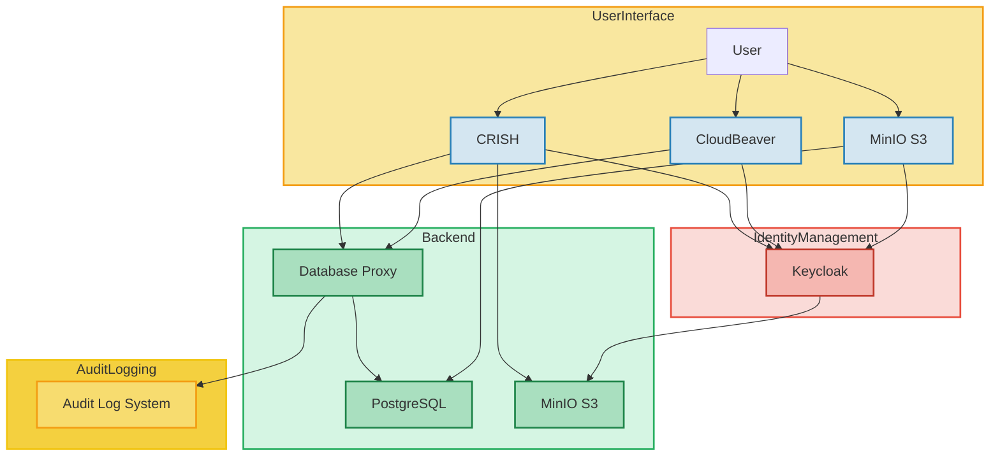

- **User Interface**: Represents the user's interaction with the system, including accessing the CRISH web app, CloudBeaver for data management, and MinIO S3 for file storage.
- **Backend**: Consists of the PostgreSQL database for storing data and the MinIO S3 storage for managing files. The CRISH communicates with PostgreSQL and MinIO.
- **Identity Management**: Keycloak handles Identity and Access Management (IAM) for the CRISH, CloudBeaver, and MinIO. All these components authenticate with Keycloak.

